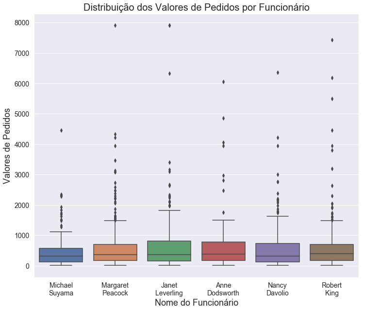
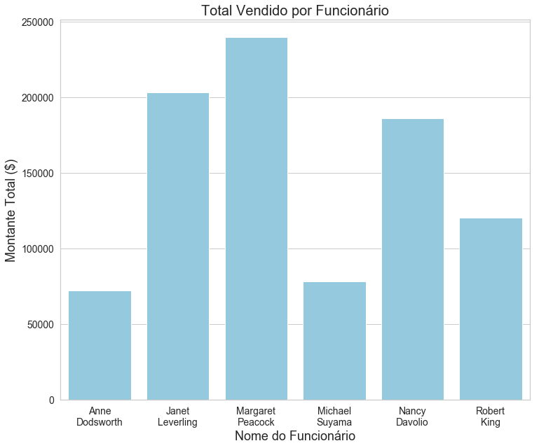
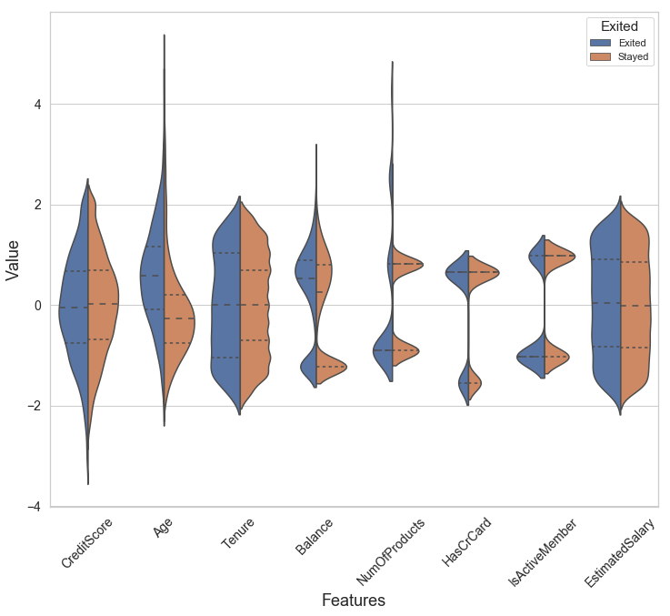

```python
%pylab inline
import pandas as pd
import seaborn as sns
import matplotlib.pyplot as plt
```

    Populating the interactive namespace from numpy and matplotlib
    


```python
df = pd.read_csv('EmployeesOrders.csv')
```


```python
df.head()
```


<div>
<style scoped>
    .dataframe tbody tr th:only-of-type {
        vertical-align: middle;
    }

    .dataframe tbody tr th {
        vertical-align: top;
    }

    .dataframe thead th {
        text-align: right;
    }
</style>
<table border="1" class="dataframe">
  <thead>
    <tr style="text-align: right;">
      <th></th>
      <th>EmployeeName</th>
      <th>OrderId</th>
      <th>Amount</th>
      <th>UnitPrice</th>
      <th>Quantity</th>
    </tr>
  </thead>
  <tbody>
    <tr>
      <th>0</th>
      <td>Michael Suyama</td>
      <td>10249</td>
      <td>167.4</td>
      <td>18.6</td>
      <td>9</td>
    </tr>
    <tr>
      <th>1</th>
      <td>Michael Suyama</td>
      <td>10249</td>
      <td>1696.0</td>
      <td>42.4</td>
      <td>40</td>
    </tr>
    <tr>
      <th>2</th>
      <td>Margaret Peacock</td>
      <td>10250</td>
      <td>77.0</td>
      <td>7.7</td>
      <td>10</td>
    </tr>
    <tr>
      <th>3</th>
      <td>Margaret Peacock</td>
      <td>10250</td>
      <td>1484.0</td>
      <td>42.4</td>
      <td>35</td>
    </tr>
    <tr>
      <th>4</th>
      <td>Margaret Peacock</td>
      <td>10250</td>
      <td>252.0</td>
      <td>16.8</td>
      <td>15</td>
    </tr>
  </tbody>
</table>
</div>


```python
sns.set(rc={'figure.figsize':(12,10), 'axes.labelsize':18, 
            'xtick.labelsize': 14, 'ytick.labelsize': 14})
```


```python
df.EmployeeName = df.EmployeeName.str.replace(' ', '\n')
```


```python
df = df[df.Amount < 8000]
```


```python
ax = sns.boxplot(x='EmployeeName', y='Amount', data=df)
ax.axes.set_title('Distribuição dos Valores de Pedidos por Funcionário', fontsize=20)
ax.set(xlabel='Nome do Funcionário', ylabel='Valores de Pedidos')
```


    [Text(0,0.5,'Valores de Pedidos'), Text(0.5,0,'Nome do Funcionário')]





```python
grouped = df.groupby('EmployeeName')[['EmployeeName','Amount']].sum()
```


```python
grouped
```


<div>
<style scoped>
    .dataframe tbody tr th:only-of-type {
        vertical-align: middle;
    }

    .dataframe tbody tr th {
        vertical-align: top;
    }

    .dataframe thead th {
        text-align: right;
    }
</style>
<table border="1" class="dataframe">
  <thead>
    <tr style="text-align: right;">
      <th></th>
      <th>Amount</th>
    </tr>
    <tr>
      <th>EmployeeName</th>
      <th></th>
    </tr>
  </thead>
  <tbody>
    <tr>
      <th>Anne\nDodsworth</th>
      <td>72424.00</td>
    </tr>
    <tr>
      <th>Janet\nLeverling</th>
      <td>203148.10</td>
    </tr>
    <tr>
      <th>Margaret\nPeacock</th>
      <td>239647.45</td>
    </tr>
    <tr>
      <th>Michael\nSuyama</th>
      <td>78198.10</td>
    </tr>
    <tr>
      <th>Nancy\nDavolio</th>
      <td>186333.71</td>
    </tr>
    <tr>
      <th>Robert\nKing</th>
      <td>120426.79</td>
    </tr>
  </tbody>
</table>
</div>


```python
aux = pd.DataFrame({'EmployeeName':grouped.index, 
                    'Amount':[grouped.Amount[i] for i in range(len(grouped.Amount))]})
grouped = aux
```


```python
ax = sns.barplot(x='EmployeeName', y='Amount', data=grouped)
ax.axes.set_title('Total Vendido por Funcionário', fontsize=20)
ax.set(xlabel='Nome do Funcionário', ylabel='Montante Total ($)')
```


    [Text(0,0.5,'Montante Total ($)'), Text(0.5,0,'Nome do Funcionário')]





```python
ax = sns.scatterplot(x='UnitPrice', y='Amount', data=df, hue='OrderId')
ax.axes.set_title('Preço Unitário x Valor do Pedido', fontsize=20)
ax.set(xlabel='Preço Unitário', ylabel='Valor do Pedido')
```


    [Text(0,0.5,'Valor do Pedido'), Text(0.5,0,'Preço Unitário')]




